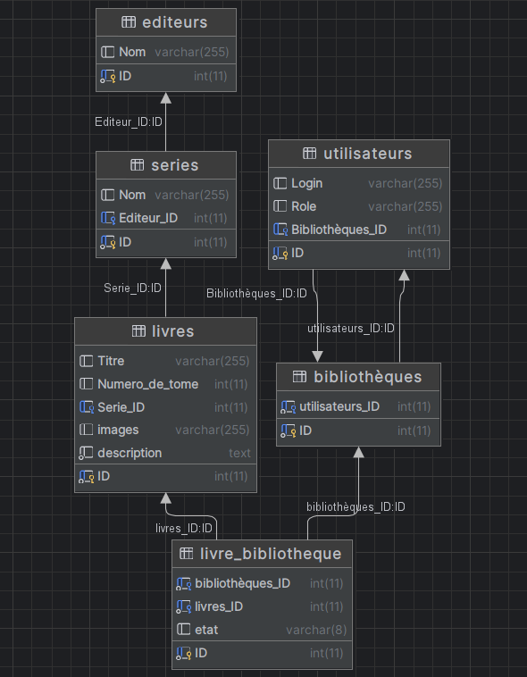

# BookTime

_Book Time is a Web Library Application for users who want to manage their reading._

### UML :
Here is the UML of the database structure

## REX Projet :

#### Florian

- Bon projet en autonomie où l'on peut avoir de l'aide. Le projet est complet, il demande des tâches sur lesquelles on doit maitriser plusieurs choses.
Amélioration : 
- Filtre
- Recommandations
- Gestion de mot de passe
Retour d'expérience : 
- React est un framework plutôt simple où l'on peut apprendre les bases très facilement puis s'améliorer en fonction des nouvelles demandes et des problèmes rencontrés. C'est toujours un peu long pour faire du Css même si ça reste des "basiques". Un peu de difficulté sur git pour apprendre les commendes, quelle commande faire pour telle chose.

#### Paul

Sur la partie base de donnée j'étais d'abord partie sur du NoSql parce que c'est ce que j'avais vue de plus ressent et c'était aussi pour essayer dans un cas concret, j'ai découvert mongoDB atlas pour faire une bdd en cloud avec mongodb ce qui avait l'air vraiment bien mais tout compte fait je suis repartie sur du mySQL car plus simple a mettre en place et plus adapté au projet de la bibliothèques, ça m'a permi de revoir ce que j'avais fait l'année dernière sauf que cette fois j'ai plus utiliser les commandes sql et moins le coté graphique de php my admin. Les types de BDD sont bien mais il faut faire beaucoup de cas par cas pour savoir quand utiliser quelle technologie

#### Pierre

Très bon projet en autonomie assisté j'ai pu apprendre le framework Spring boot que j'ai adoré étudier. Très intéressant même si semble complexe au première abord. J'ai également pu apprendre à utilisé les DTO qui me permette d'utilisé de façon propre ma base de donnée avec mon back sans dévoilé la structure de ma base de données. J'ai beaucoup aimé l'encadrement sur le projet, en laissant de la liberté mais en nous aidant en cas de besoin.